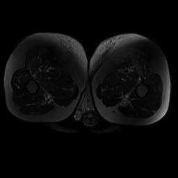
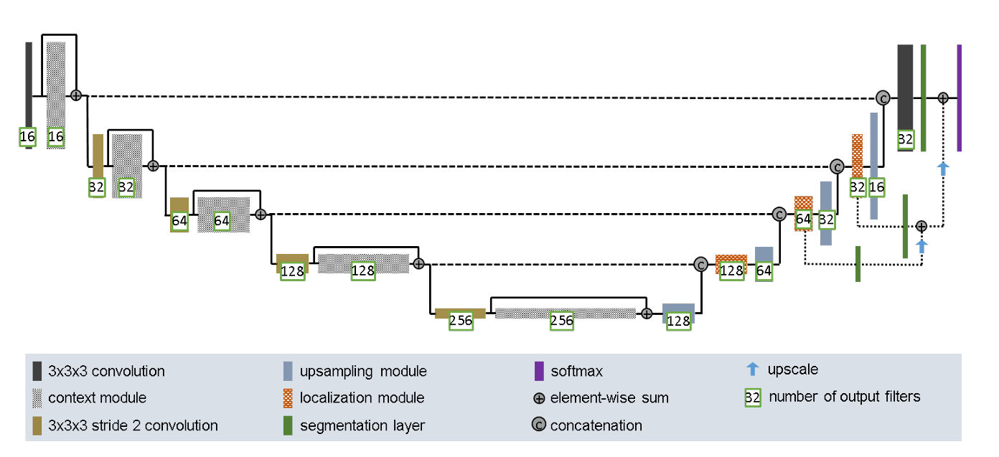
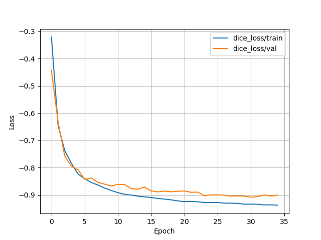
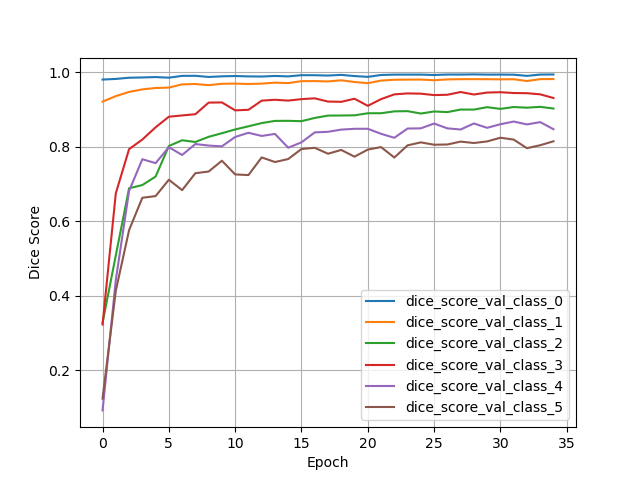
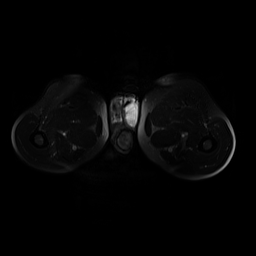
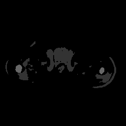

# Improved 3D UNet for Volumetric Segmentation of Pelvis Dataset (Hard Difficulty)

The files contained in this directory implement the Improved 3D UNet from [1], and apply it to segment the pelvis dataset from [4].

The following table shows the input MRI image, ground truth labels and generated segmentation labels for the case `C032_Week0`. The classes in order of brightness are "Background", "Body", "Bones", "Bladder", "Rectum" and "Prostate".

| Input | Ground Truth | Generated Segmentation |
| :---: | :---: | :---: |
|   |  |  |


## Usage
### Installation
#### Windows with conda
To install the required dependencies, create a new conda environment and install the packages from the environment.yaml file in this directory. For example:
```bash
conda env create --name unet3d --file .\environment.yaml
```

#### Others with pip

The yaml file describes the environment setup for Windows using conda. For other OS's, you will need to install the following packages:
- torch (2.9.0+cu126)
- torchio (0.20.23)
- numpy (2.3.3)
- matplotlib (3.10.7)
- tensorboard (2.20.0)
- tqdm (4.67.1)

The `requirements.txt` file may be installed by activating a python venv and running
```bash
pip install -r requirments.txt
```

### Description of files

The main files are:
1. `train.py` - handles training the Improved 3D UNet model, logging data, and saving the model and optimiser state for later use
2. `predict.py` - used to produce performance metrics for a trained model, such as dice scores and the animated GIFs shown in the introduction.

These scripts accept commandline arguments. Their help pages are:
```bash
usage: train.py [-h] [--test] [--compile] [--prev PREV] [--epochs EPOCHS] [--lr LR] [--data DATA]
                [--batch BATCH]

trains the 3D Improved UNet Model

options:
  -h, --help       show this help message and exit
  --test           test the model on the test set (requires specifying --prev)
  --compile        JIT compile the model for faster performance (Linux only)
  --prev PREV      timestamp of previous model to load, YYYYMMDD-HHMMSS. If not provided, train a new      
                   model
  --epochs EPOCHS  number of epochs to train for
  --lr LR          learning rate to use
  --data DATA      path to directory containing dataset
  --batch BATCH    batch size (only 1 is supported currently due to data augmentation)
```

```bash
usage: predict.py [-h] --model MODEL [--test] [--data DATA] [--graphs] [--vis VIS]

tests and visualises a saved model

options:
  -h, --help     show this help message and exit
  --model MODEL
  --test         test the model on the test set
  --data DATA    path to directory containing dataset
  --graphs       create visualations of training metrics
  --vis VIS      index within testing data of input image from which to produce animated GIF segmentations
```

These scripts are supported by the following files:
1. `modules.py` - contains the definition of the `Improved3DUNet()` class.
2. `dataset.py` - handles data splitting and augmentation
3. `utils.py` - utility functions

## Data preparation

### Splitting

The data was split into training, validation and testing sets, to ensure the final results on the test set would accurately reflect the model's performance on unseen samples.

Samples were allocated to each set in batches corresponding to each patient, to ensure no data leakage occured - i.e. to ensure that MRIs from the same patient did not appear in both the training and testing sets.

Some patients did not have the full number of 8 scans. The number of patients with each type of scan are as follows:
| Number of Images  | 1 | 2 | 3 | 4 | 5 | 6 | 7 | 8 |
| :---: | :---: | :---: | :---: | :---: | :---: | :---: | :---: | :---: |
| Number of Patients  | 11 | 1 | 0 | 1| 1 | 1 | 1 |  22 |

The ratio for the train, validation and test sets was set to be 8:1:2, so patients with 1 or 8 images were randomly allocates according to this ratio. The the remaining patient images remaining was 24 (2+4+5+6+7). 

According to the 8:1:2 ratio, the number of images allocate to the train, validation and test sets should be 17.45, 2.18 and 4.36. Therefore, the patient with 2 images was allocated to the validation set, the patient with 4 images was allocated to the testing set, and the remaining patients were allocated to the testing set.

The final number of images in each set was then 154, 19 and 38, which gives a ratio of 8:0.987:1.974 - close to the target split ratio.

### Augmentations

All images were rescaled so the minimum intensity was zero and the maximum intensity was one.

Data augmentation was applied to the training set images and labels to perform regularisation to prevent overfitting. The [torchio](https://github.com/TorchIO-project/torchio) library streamlines this process greatly for 3D medical images. 25% of the time, no augmentation was applied and 75% of the time, either a random affine transformation (80% probability) or a random elastic deformation (20% probability) was applied.


## Network Setup

### Layers

The implemented structure follows from [1], as shown in the below figure (taken from [1]).



The Improved 3D UNet has a downsampling and upsampling path, with new additions to the traditional UNet being the extra skip connections used to form the final segmentation output. The Improved 3D UNet design also uses a direct upscale operation instead of the traditional transposed convolution operation, which [1] claims reduces checkboard patterns in the output.

The downsampling path uses strided convolutions (kernel size of 3) and residual blocks called 'context' modules to reduce the image size while increasing the number of channels, with the aim to extract higher level features of the image. The context modules have two convolutional layers separated by instance normalisation and dropout layers - these implement the 'pre-activation residual block' described in [3].

Theses high-level patterns are then used in the upsampling path to create the final segmentation. The localisation modules in the upsampling path apply convolutions to reduce the number of feature maps, and combine these maps with the outputs of each downsampling layer using skip-connections. These connections promote gradient flow throughout the network. An additional improvement introduced by the Improved 3D UNet is the usage of the 'deep supervision', where the output of the final two localisation modules is combined directly (via a segmentation layer to correct the number of channels), with the final output of the network. This is done so gradients flow more evenly through the network, reducing the vanishing gradients problem.

Segmentations are one-hot encoded, with six channels on the output so that one corresponds to each class. This is required so that no order is conferred on the classes, as would happen if the output layer had only one channel, and the network had to predict class indices.

Some minor modifications to the structure were made:
1. Adding padding as needed to the layers so that the output segmentation maps's size matched the input image size
2. The dropout layers were effectively removed (by setting the probability to zero). This was done since it did not cause overfitting (see the results section), so therefore allowed for faster training. This means the data augmentation strategies employed added enough regularisation to prevent overfitting without the need for dropout layers.

### Loss Function

The standard cross entropy loss does not promote good segmentation performance when classes are imbalanced, which is often the case in medical datasets like the pelvis dataset. Therefore, as recommended by [1], the following differentiable multiclass dice loss is used:

$$\mathcal{L}_{dc} = -\frac{2}{|K|} \sum_{k\in K} \frac{\sum_i u_{i,k} v_{i,k}}{\sum_i u_{i,k} + \sum_i v_{i,k}}$$

where $u_{i,k}$ is the one-hot network output for the $i$th for class $k$ and $v_{i,k}$ is the one-hot encoded ground truth label (1 if voxel $i$ is of class $k$, 0 if not). This function is implemented in the `loss()` method of the `Improved3DUNet` in `modules.py`.

For assessing validation and testing performance, the traditional 'hard' dice score is used:

$$DSC = \frac{2|X\cap Y|}{|X| + |Y|}$$

This metric is not differentiable since it requires counting counting the absolute predictions made by the network, which uses the non-differentiable argmax function.

### Optimiser

The network was trained using the Adam optimiser with a learning rate of 5e-5. Higher learning rates were found to lead to slower progress, indicating the step size was too large. Additionally the `eps` parameter of Adam was increased to 1e-6 to prevent problems of dividing by very small numbers.

### Optimisations and Batch Size

Given the large size of the training images and labels (256x256x128), training was initially slow, and consumed large amounts of GPU memory. This was prohibitive when attempting to train on non-cluster hardware. For this reason, the image data was compressed to half-precision (FP16), and PyTorch's [automatic mixed-precision](https://docs.pytorch.org/docs/stable/amp.html) was used to reduce the memory footprint of both the data and the model. Converting operations to FP16 also allow for faster compute times. This enabled a speedup of roughly a factor of 4x on an RTX2080 Super (single image training cycle time reduced from ~16 seconds to ~4 seconds).

These optimisations likely carried over well to the final training which was done on an A100 GPU (UQ's Rangpur cluster), where the 35 epochs were completed in 3 hrs 37 mins, or an average of 6.2 minutes per epoch. In all cases, a batch size of one was used as increasing this did not improve epoch completion time, and caused issues with conflicting image sizes produced by the data augmentation operations.

## Results

The following table gives the test set dice scores for each class, showing that all were above the 0.8 threshold.

| Class | Background (0) | Body (1) | Bones (2) | Bladder (3) | Rectum (4) | Prostate (5) |
| :---: | :---: | :---: | :---: | :---: | :---: | :---: |
| **Dice Score on Test Set**  | 0.996 | 0.961 | 0.901 | 0.947 | 0.836 | 0.844 |

The following figure shows the behaviour as the model trained by plotting the dice loss under both the training
and validation sets. The validation loss can be seen to plateau while the training curve still slightly decreases, indicating that further training of the model would may result in overfitting without additional regularisation. The network was trained for 35 epochs, which took 3 hrs 37 mins on an A100 GPU on UQ's Rangpur cluster.



The following plot shows the improvement in validation set dice scores as the training progressed, showing how all reached above the 0.80 threshold by the final epoch. Note that the dice scores in the above table are for the *test* set, not the validation set. The validation set was montiored during training, while the test set was only used once at the end to assess the performance of the final model.



As a bonus, here are some more segmentation comparisons, this time for case `G021_Week2`. The generated segmentations follow the input labels very well, although it can be seen that sometimes background pixels (black) are erroneously added inside the body in between otherwise correct classes. This may be address by experimenting with training for more epochs and using a learning rate scheduler to reduce the learning rate in later epochs. To prevent overfitting, dropout may need to be re-introduced.
| Input | Ground Truth | Generated Segmentation |
| :---: | :---: | :---: |
|   |  |  |

## Conclusions

The network performed very well and met the performance requirements. The main limitation was the erroneous background pixels as described in the results section, which could potentially be addressed through further training and learning rate schedulers.

Further work could also examine lower memory consumption models to perform the same task, such as CAN3D [2].


## References

[1] F. Isensee, P. Kickingereder, W. Wick, M. Bendszus, and K. H. Maier-Hein, “Brain Tumor Segmentation and Radiomics Survival Prediction: Contribution to the BRATS 2017 Challenge,” Feb. 28, 2018, arXiv: arXiv:1802.10508. doi: 10.48550/arXiv.1802.10508.

[2] W. Dai et al., “CAN3D: Fast 3D Medical Image Segmentation via Compact Context Aggregation,” Sept. 22, 2021, arXiv: arXiv:2109.05443. doi: 10.48550/arXiv.2109.05443.

[3] K. He, X. Zhang, S. Ren, and J. Sun, “Identity Mappings in Deep Residual Networks,” July 25, 2016, arXiv: arXiv:1603.05027. doi: 10.48550/arXiv.1603.05027.

[4] J. Dowling and P. Greer, “Labelled weekly MR images of the male pelvis.” CSIRO, 2021. doi: 10.25919/45T8-P065.
